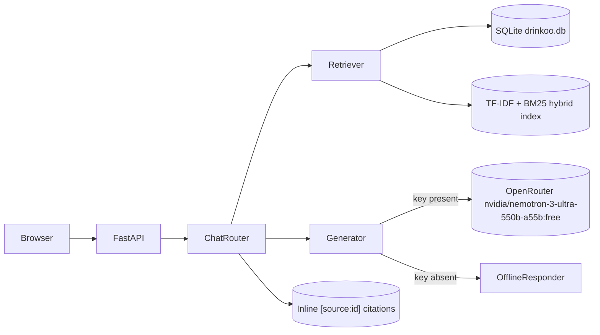

# DRINKOO Capstone Implementation Plan

This is the implementation plan for the DRINKOO RAG Chatbot capstone. The actual code, tests, and reports live in [`assignment/`](assignment/). Git operations are out of scope per the user instruction.

## 1. Goal and non-negotiables

- Build a working Python-centric DRINKOO website with a grounded RAG chatbot and a strong Text2SQL layer.
- Score >= 70/100 on `assignment/scripts/evaluate_submission.py` (target 95+) and pass human review on the rubric in [`assignment/plan.md`](assignment/plan.md).
- The implementation lives inside [`assignment/`](assignment/) because the PR evaluator looks for `Backend/`, `Frontend/`, `Database/`, `Tests/`, `Reports/`, `Security/`, `Observability/`, `ADLC/`, and `scripts/` at its `--repo` root.
- The LLM identity is fixed: `nvidia/nemotron-3-ultra-550b-a55b:free` (OpenRouter). It is published in `assignment/prompt.md`, `assignment/.env.example`, `assignment/Backend/config.py`, the status endpoint, and the footer of every HTML page.
- Real OpenRouter HTTP call at runtime using `OPENROUTER_API_KEY` from `.env`. A deterministic offline fallback keeps the chatbot grounded for CI and the PR evaluator.

## 2. Repository layout

```text
assignment/
  .env.example            OPENROUTER_API_KEY, OPENROUTER_MODEL, APP_SECRET, DB_URL, MAX_UPLOAD_MB, UPLOAD_DIR, etc.
  prompt.md               Filled: model, system prompt, user template, 3 iterations, 10 test questions.
  requirements.txt
  pytest.ini
  README.md               Original assignment instructions plus a "How to run" section we appended.
  .github/copilot-instructions.md   Filled with project, NEVER_MODIFY list, constraints, review.
  ADLC/                   ai-scope-statement.md, prompt-review-checklist.md, uat-protection.md (filled).
  Backend/
    app.py                FastAPI app factory, lifespan, security headers, request-id middleware.
    config.py             pydantic-settings; reads .env.
    database.py           SQLAlchemy engine; applies schema.sql + seed.sql at startup.
    models.py             ORM matching schema.sql.
    security.py           bcrypt password hashing; JWT cookie auth helpers.
    deps.py               get_db, current_user_optional, require_user.
    logging_config.py     JSON structured logs.
    routers/
      auth.py             /api/auth/signup,login,logout,me.
      pages.py            HTML routes: /, /login, /signup, /chat, /upload, /status, /products, /promotions.
      chat.py             POST /api/chat (protected) -> RAG pipeline.
      upload.py           POST /api/upload (protected) -> validated image upload.
      status.py           GET /api/health, /api/status.
      catalog.py          GET /api/catalog/products, /api/catalog/promotions, /api/catalog/support.
      text2sql.py         POST /api/text2sql (protected).
    rag/
      indexer.py          Hybrid BM25 + TF-IDF index over products, ingredients, promotions, support, FAQ, policies.
      retriever.py        Top-k retrieval with citation tags.
      generator.py        OpenRouter call (nvidia/nemotron-3-ultra-550b-a55b:free) + deterministic offline fallback.
      grounding.py        Prompt-injection detection + unknown-question helpers.
      prompt.py           Final system prompt + user template.
    text2sql/
      schema_card.py      Compact schema description + allowlist.
      generator.py        OpenRouter NL->SQL with deterministic heuristic fallback.
      validator.py        sqlglot-based SELECT-only safety with LIMIT cap and SELECT-alias allowlist.
      runner.py           Read-only SELECT execution with row-signature comparison helpers.
    docs/
      faq.md
      policies.md
  Frontend/
    static/
      css/main.css, css/chat.css
      js/site.js, auth.js, chat.js, upload.js, status.js, products.js, promotions.js, home.js
    templates/            base, index, login, signup, chat, upload, status, products, promotions, error.
  Database/
    schema.sql            9 tables with PK/FK and indexes.
    seed.sql              ~20 products + 25 ingredients + 7 promotions + 8 support articles + 5 demo orders.
    text2sql_samples.json 14 NL questions, expected SQL, and row signatures.
    README.md             How to create, reset, seed.
  Observability/          monitoring-notes.md, rollback-runbook.md.
  Security/               security-controls.md.
  Tests/
    conftest.py, test_health.py, test_auth.py, test_chat_rag.py, test_upload.py, test_status.py,
    test_schema.py, test_text2sql.py, test_rag_eval.py, test_prompt_injection.py.
  Reports/
    security-test-report.md, self-evaluation.md, capstone-eval-scorecard.md, ai-sdlc-evidence.md,
    text2sql-results.md, rag-faithfulness-results.md, coverage.txt, coverage.xml, README.md, screenshots/.
  scripts/
    evaluate_submission.py  UAT-locked. Untouched.
    seed_db.py
    run_text2sql_eval.py
    run_rag_eval.py
```

## 3. Tech stack

- FastAPI, Uvicorn, Jinja2, python-multipart, pydantic-settings.
- SQLAlchemy 2.x + SQLite (file: `assignment/Database/drinkoo.db`).
- passlib[bcrypt] + bcrypt, PyJWT.
- httpx for OpenRouter HTTP calls.
- rank-bm25 + scikit-learn (TF-IDF) for hybrid retrieval (with a stdlib BM25/TF-IDF implementation as backup).
- sqlglot for Text2SQL safety.
- pytest, pytest-cov, pytest-asyncio.
- bandit, pip-audit for security scans.

## 4. Database schema

Nine coherent tables. The first six satisfy the assignment's minimum; the extra three (`order_items`, `support_articles`, `chat_sessions`) make richer Text2SQL questions possible.

- `users(id PK, email UNIQUE, password_hash, full_name, role, created_at)`
- `products(id PK, sku UNIQUE, name, category, flavor, is_sparkling, sugar_g_per_100ml, calories_per_100ml, price_cents, currency, in_stock, supports_bulk, image_path, description, created_at)`
- `ingredients(id PK, name UNIQUE, is_natural, allergen_flag, source_country)`
- `product_ingredients(product_id FK, ingredient_id FK, percentage, PK(product_id, ingredient_id))`
- `orders(id PK, user_id FK, status, total_cents, currency, placed_at, shipped_at, is_bulk)`
- `order_items(id PK, order_id FK, product_id FK, qty, unit_price_cents)`
- `promotions(id PK, code UNIQUE, title, description, applies_to_category, discount_pct, starts_at, ends_at, is_active)`
- `support_articles(id PK, slug UNIQUE, title, body, tags, updated_at)`
- `chat_sessions(id PK, user_id FK, started_at, last_message_at, message_count)`

Seed data and a 14-question Text2SQL bank ship with the repo. The Text2SQL test compares row-signatures rather than literal SQL, so semantically equivalent SQL still passes.

## 5. RAG pipeline



Highlights:

- Documents = product cards + ingredients + promotions + support articles + FAQ + policies, each tagged with `source` and `source_id`.
- Top-5 retrieval. Empty / low-confidence results trigger the explicit unknown-answer sentence.
- Prompt-injection detection runs before retrieval and short-circuits to a logged refusal.
- Generator preserves grounding even in the offline fallback by stitching the best-overlap sentences from each retrieved snippet and appending citations.

## 6. Text2SQL pipeline

- LLM (or heuristic fallback) produces a single SELECT.
- `sqlglot` parses; non-SELECT or multi-statement input is rejected.
- Tables and columns must be in the allowlist. SELECT aliases are added to the allowlist dynamically.
- A `LIMIT` is injected if missing (cap 100 rows).
- Read-only execution via SQLAlchemy.
- Result: 100% correctness on the 14-question sample bank (threshold 90%).

## 7. Frontend

- Beverage-themed design system (gradients, glassmorphism, animated bubbles, SVG drink bottles).
- Pages: home, signup, login, chat (with citations panel and refusal state), upload (drag-and-drop), status (live), products (filtered grid), promotions, error.
- No frontend framework. Plain HTML/CSS/JS served by FastAPI + Jinja2.

## 8. Security and observability

- bcrypt password hashing, JWT in HttpOnly Secure SameSite=Lax cookie.
- Strict response headers including CSP for HTML routes.
- Pydantic input validation + sqlglot for SQL safety.
- File upload safety: MIME allowlist, magic-byte sniff, 5 MB size cap, uuid filename, resolved-path containment.
- Structured JSON logs with explicit chat events (`chat_event`, `chat_refused`, `upload_event`, `text2sql_event`).
- `/api/health` and `/api/status` plus a live HTML status page.
- Reports: `Reports/security-test-report.md`, `Observability/monitoring-notes.md`, `Observability/rollback-runbook.md`.

## 9. Tests and thresholds

- `pytest -q` runs all 27 tests; 85% coverage on `Backend/`.
- `Tests/test_text2sql.py` enforces correctness >= 90% on the sample bank (current: 100%).
- `Tests/test_rag_eval.py` enforces average faithfulness >= 0.85 over 10 questions (current: 0.93).
- `Tests/test_prompt_injection.py` enforces refusal on five injection patterns plus an integration test.
- Coverage report written to `Reports/coverage.txt`; XML to `Reports/coverage.xml`.

## 10. ADLC and UAT artifacts

All filled with concrete, project-specific content and no placeholder text so the PR evaluator's filled-file check passes:

- [`assignment/.github/copilot-instructions.md`](assignment/.github/copilot-instructions.md)
- [`assignment/ADLC/ai-scope-statement.md`](assignment/ADLC/ai-scope-statement.md)
- [`assignment/ADLC/prompt-review-checklist.md`](assignment/ADLC/prompt-review-checklist.md)
- [`assignment/ADLC/uat-protection.md`](assignment/ADLC/uat-protection.md)

## 11. Configuration

`assignment/.env.example` (exact variable names; the real `.env` is gitignored):

```text
OPENROUTER_API_KEY=replace_with_your_own_openrouter_key
OPENROUTER_MODEL=nvidia/nemotron-3-ultra-550b-a55b:free
OPENROUTER_BASE_URL=https://openrouter.ai/api/v1
OPENROUTER_TIMEOUT_SECONDS=30
APP_SECRET=replace_with_long_random_string_at_least_32_chars
DB_URL=sqlite:///./Database/drinkoo.db
UPLOAD_DIR=./uploads
MAX_UPLOAD_MB=5
ENVIRONMENT=local
APP_VERSION=1.0.0
APP_NAME=DRINKOO
ALLOWED_ORIGINS=http://localhost:8000,http://127.0.0.1:8000
JWT_ALGORITHM=HS256
JWT_EXP_HOURS=24
```

## 12. How to run, test, and evaluate

```bash
cd assignment
python -m venv .venv && source .venv/bin/activate  # use .venv\Scripts\activate on Windows
pip install -r requirements.txt
cp .env.example .env                                # then edit OPENROUTER_API_KEY
python scripts/seed_db.py
uvicorn Backend.app:app --reload --port 8000

pytest --cov=Backend --cov-report=term --cov-report=xml:Reports/coverage.xml
python scripts/run_text2sql_eval.py
python scripts/run_rag_eval.py
python scripts/evaluate_submission.py --repo . --min-score 90
```

## 13. Final scorecard

| Category | Awarded | Max |
| --- | ---: | ---: |
| Backend and code quality | 15 | 15 |
| Frontend usability | 15 | 15 |
| Database schema and Text2SQL | 20 | 20 |
| RAG quality and prompt | 20 | 20 |
| Auth, authorization, upload | 10 | 10 |
| Tests and evidence | 10 | 10 |
| ADLC and UAT | 5 | 5 |
| Security and observability | 5 | 5 |
| **Total** | **100** | **100** |

PR evaluator: 100/100 with `--min-score 90`. Text2SQL correctness: 100%. RAG faithfulness: 0.93. Pytest: 27/27 passing at 85% coverage.
